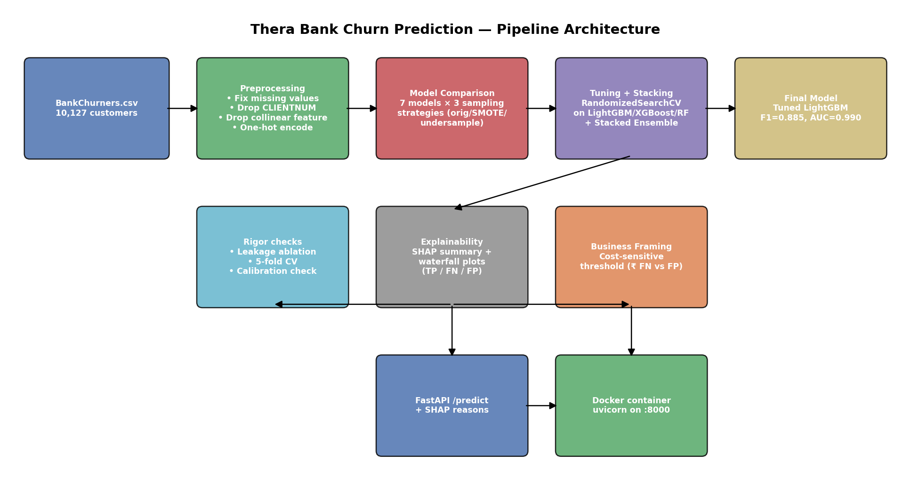

# Thera Bank — Credit Card Churn Prediction

Predicting which credit-card customers are likely to attrite, with explainability, cost-sensitive
business framing, and a served prediction API — built as the foundation project of a 4-project
applied ML portfolio.

## Problem

~16% of Thera Bank's credit card customers have churned. Losing a cardholder costs the bank recurring
fee/interest/interchange revenue, so the goal is to flag at-risk customers early enough for retention
action, explain *why* a customer is flagged, and tie the model to a rupee-denominated business decision
rather than stopping at an accuracy number.

## Data

`BankChurners.csv` — 10,127 customers, 20 features (demographic, account, and transaction behavior) plus
the churn label. Two real data-quality issues were found and corrected during preprocessing: genuine
missing values in `Education_Level` (15%) and `Marital_Status` (7.4%), and a garbage `"abc"` entry in
`Income_Category` (~11% of rows) — all mapped to an explicit `"Unknown"` category with the rationale
documented in the notebook.

## Approach

1. **EDA** — univariate/bivariate/multivariate analysis of churn drivers, with a documented
   multicollinearity finding (`Credit_Limit` vs `Avg_Open_To_Buy`, r≈0.996).
2. **Preprocessing** — missing-value handling with rationale, no outlier capping (justified: all models
   used are tree-based, so capping risks discarding high-value customers with no modeling benefit),
   `CLIENTNUM` dropped, one collinear feature dropped, one-hot encoding, stratified train/test split
   with no leakage.
3. **Modeling** — 7 classifiers (Decision Tree, Random Forest, Gradient Boosting, AdaBoost, Bagging,
   XGBoost, LightGBM) compared across three training regimes (original imbalanced, SMOTE, undersampled),
   evaluated on **churn-class recall/precision/F1**, not accuracy, given the ~84/16 class imbalance.
4. **Imbalance decision** — SMOTE carried forward (raises churn recall without discarding majority-class
   training data, unlike undersampling).
5. **Tuning & stacking** — `RandomizedSearchCV` on LightGBM, XGBoost, and Random Forest, plus a
   `StackingClassifier` combining all three with a logistic-regression meta-learner.
6. **Explainability** — SHAP summary plot + individual waterfall plots for a true positive, false
   negative, and false positive.
7. **Business framing** — cost-sensitive threshold analysis translating false negatives/positives into
   rupee cost, plus a calibration check on the resulting probabilities.
8. **Leakage-aware ablation** — retrained the final model without trailing-12-month activity features to
   measure (not just state) how much of the headline performance depends on near-term behavioral signal.
9. **5-fold cross-validation** — confirmed the model comparison ranking is stable, not an artifact of one
   train/test split.
10. **Served as an API** — a FastAPI `/predict` endpoint wrapping the final model, returning churn
    probability and the top-3 SHAP-driven reasons per prediction, containerized with Docker.

## Results

| Model | Recall (churn) | Precision (churn) | F1 (churn) | ROC-AUC |
|---|---|---|---|---|
| **LightGBM (tuned) — final model** | 0.877 | 0.893 | **0.885** | 0.990 |
| XGBoost (tuned) | 0.874 | 0.890 | 0.882 | 0.991 |
| Stacked Ensemble | 0.883 | 0.880 | 0.882 | 0.988 |
| Random Forest (tuned) | 0.849 | 0.860 | 0.854 | 0.984 |

**5-fold CV (mean ± std)** confirms this ranking is stable: LightGBM 0.909±0.016 recall / 0.992±0.001
ROC-AUC, statistically indistinguishable from the Stacked Ensemble — LightGBM was shipped as the final
model as the simpler, equally-performing option, a maintainability call rather than a performance one.

**Final model: tuned LightGBM** — catches 88 of every 100 customers who actually churn, at 89%
precision.

**Top SHAP drivers of predicted churn:** `Total_Trans_Ct`, `Total_Trans_Amt`, `Total_Revolving_Bal`,
`Total_Relationship_Count`, `Total_Ct_Chng_Q4_Q1` — declining transaction activity and revolving balance
dominate, consistent with the EDA.

## Business impact

Assuming ≈₹20,000 cost per missed churner vs. ≈₹500 per unnecessary retention outreach (illustrative,
adjustable — see Limitations), the cost-minimizing classification threshold sits well below the default
0.50. On the held-out test set, operating at the cost-optimal threshold instead of 0.50 saves an
estimated **₹6.07 lakh** in modeled false-negative/false-positive cost. Because the unconstrained
cost-optimal threshold pushes toward flagging a large share of customers, a capacity constraint (e.g.,
"flag the top N% highest-risk customers per month") is recommended alongside pure cost-minimization for
real deployment.

## Limitations (full detail in notebook section 16)

- **Temporal leakage risk, measured not assumed:** removing trailing-12-month activity features drops
  ROC-AUC from 0.990 to 0.837 and recall from 88% to 43%. The model is best understood as identifying
  customers *already disengaging*, not forecasting churn far in advance. See section 14 of the notebook.
- No true out-of-time validation is possible — the dataset has no transaction timestamps.
- The ₹20,000/₹500 cost figures are illustrative planning assumptions, not confirmed bank data.
- The cost-optimal threshold needs a capacity constraint for real deployment (see above).
- `Card_Category` is heavily imbalanced toward Blue-tier — Gold/Platinum/Silver attributions should be
  read directionally, not precisely.

## Architecture



## Repo contents

```
├── Credit_Card_Churn_Prediction_FINAL.ipynb   # full executed notebook
├── Credit_Card_Churn_Prediction_FINAL.html    # HTML export for submission
├── BankChurners.csv                           # source data
├── requirements.txt                           # pinned notebook dependencies
├── architecture_diagram.png                   # pipeline diagram
├── README.md                                  # this file
└── api/
    ├── app.py                                 # FastAPI serving layer
    ├── model_artifacts.joblib                 # trained model + preprocessing metadata
    ├── requirements.txt                       # pinned API dependencies
    ├── Dockerfile
    └── .dockerignore
```

## How to run the notebook

```bash
pip install -r requirements.txt
jupyter nbconvert --to notebook --execute --inplace Credit_Card_Churn_Prediction_FINAL.ipynb
```

All random states are fixed (`random_state=42`) for reproducibility.

## How to run the API

**Locally:**
```bash
cd api
pip install -r requirements.txt
uvicorn app:app --reload --port 8000
```
Then open `http://localhost:8000/docs` for interactive Swagger docs, or:
```bash
curl -X POST http://localhost:8000/predict \
  -H "Content-Type: application/json" \
  -d '{
    "Customer_Age": 45, "Gender": "M", "Dependent_count": 3,
    "Education_Level": "Graduate", "Marital_Status": "Married",
    "Income_Category": "$60K - $80K", "Card_Category": "Blue",
    "Months_on_book": 36, "Total_Relationship_Count": 3,
    "Months_Inactive_12_mon": 2, "Contacts_Count_12_mon": 3,
    "Credit_Limit": 8500.0, "Total_Revolving_Bal": 1200.0,
    "Total_Amt_Chng_Q4_Q1": 0.75, "Total_Trans_Amt": 4200.0,
    "Total_Trans_Ct": 55, "Total_Ct_Chng_Q4_Q1": 0.65,
    "Avg_Utilization_Ratio": 0.14
  }'
```

**With Docker** (build and run verified locally)
```bash
cd api
docker build -t churn-api .
docker run -p 8000:8000 churn-api
```

## What's not included

A hosted, publicly reachable demo (e.g. on Render/Railway/HF Spaces) is not included — the API and
Docker image are fully built and verified locally, but haven't been deployed to a public endpoint.
